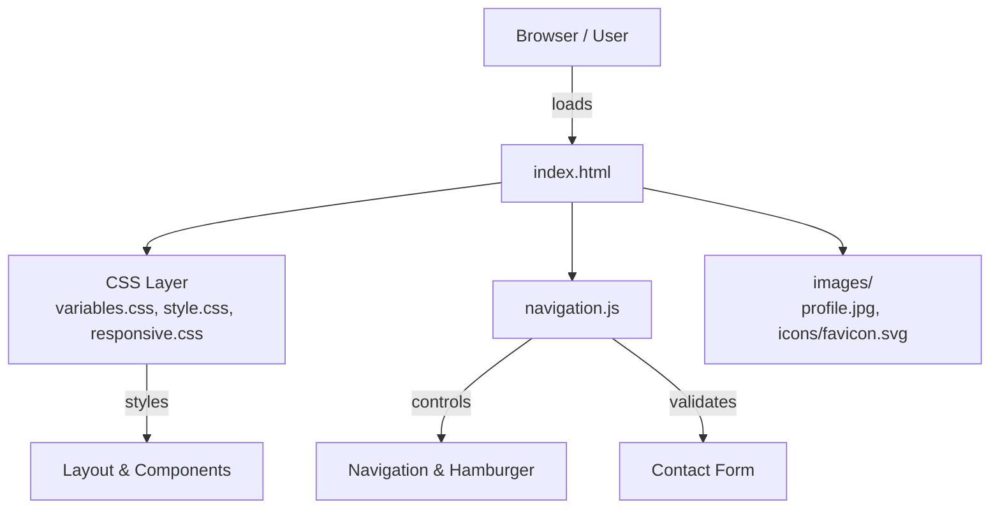

# Week 1: Responsive Personal Portfolio

A responsive personal portfolio website for **Kuncham Venkata Satya Manikanta**, showcasing full‑stack skills, projects, and contact information. Built as part of **Week 1: HTML & CSS Foundations**.

## Live Sections
- Live Link: https://developers-arena.vercel.app/
- Hero: name, title, and call‑to‑action buttons
- About: summary from resume
- Skills: categorized tech stack (frontend, backend, tools, DevOps)
- Projects: Resume Builder V5, Chat Rooms, Android Apps Collection
- Contact: location, email form, and social links
- Footer: copyright + GitHub / LinkedIn

## Features
- Responsive layout (mobile, tablet, desktop)
- Semantic HTML5 structure
- Flexbox / grid‑based layouts
- Sticky navigation with smooth scrolling and offset for section headings
- Accessible navigation and contact form (labels, ARIA attributes, focus states)
- Basic client‑side form validation (required fields + email pattern)
- SVG favicon stored in `images/icons/favicon.svg`

## Architecture (Mermaid)



## Project Structure

```text
week1-portfolio/
├── index.html
├── css/
│   ├── style.css          # core layout and components
│   ├── responsive.css     # mobile / tablet tweaks
│   └── variables.css      # colors, typography, spacing tokens
├── js/
│   └── navigation.js      # mobile nav toggle + form validation
├── images/
│   ├── profile.jpg        # your profile photo
│   └── icons/
│       └── favicon.svg    # tab icon
├── README.md
├── DOCUMENTATION.md       # detailed architecture & testing docs
└── .gitignore
```

## Getting Started

1. Open `index.html` directly in your browser (or serve via a simple static server).
2. Replace `images/profile.jpg` with your own photo (use the same file name).
3. Update any text you want in `index.html` (sections: About, Skills, Projects, Contact).

## Running The Site

1. Open the folder of the Codebase
2. Run this command
```
 echo "Server running at http://localhost:8000"; python -m http.server 8000
```
## Personalization Details

- **Name / Title**: "Kuncham Venkata Satya Manikanta – Passionate Full‑Stack Developer".
- **Hero CTA**: "View Projects" and "Contact Me" buttons.
- **Projects**: Resume Builder V5, Chat Rooms, Android Apps Collection.
- **Socials**:
  - GitHub: `https://github.com/monkey9-Cyber-cat-Spidy`
  - LinkedIn: `https://www.linkedin.com/in/kvsmanikanta/`

## Accessibility & Quality Checklist

- [ ] All images include descriptive `alt` text
- [ ] Navigation is keyboard accessible (Tab through links and buttons)
- [ ] Form fields have labels and error messages
- [ ] HTML and CSS validate without major errors
- [ ] Layout works on small, medium, and large screens

## License

Personal learning project – feel free to modify and use it as your own portfolio starter.
